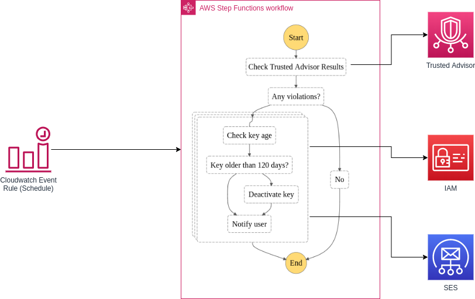
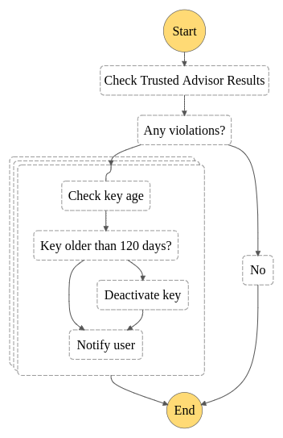

# AWS Access Key Check

## Overview
This solution deploys a step functions workflow that is designed to detect user IAM access keys that are older than 90 days. It will send out an  email notification to the affected user every day until it is resolved. For access keys older than 120 days, the key will be deactivated.


## Requirements
* Python >= 3.6
* Boto3
* AWS Account's Support subscription (Business/Enterprise)
* Tag key `Email` for each IAM user

## Architecture




```
access_key_check/
├── architecture.png
├── functions
│   ├── access_key_check_key_age
│   │   └── index.py
│   ├── access_key_deactivate_key
│   │   └── index.py
│   ├── access_key_notify_user
│   │   └── index.py
│   └── access_key_results_check
│       └── index.py
├── README.md
├── stepfunctions_graph.png
└── terraform
    ├── access_key_check_definitions.json
    ├── iam.tf
    ├── main.tf
    ├── output.tf
    ├── provider.tf
    ├── remote_state.tf
    ├── variables.tf
    └── vars
        ├── ops_backend.tfvars
        ├── ops.tfvars
        ├── test_backend.tfvars
        └── test.tfvars
```

## Deployment
* Initialize Terraform backend according to the environment
```
cd terraform
terraform init -backend-config vars/ops_backend.tfvars
```

* Deploy setup with terraform
```
terraform plan -var-file vars/ops.tfvars
terraform apply -var-file vars/ops.tfvars
```

**Note:**
* Replace the environment ops with the correct environment name
* `tfvars` file is a file containing environment specific variables and configurations.
* There is no need to create zip file for the lambda functions. Terraform will create a zip package for the functions.
